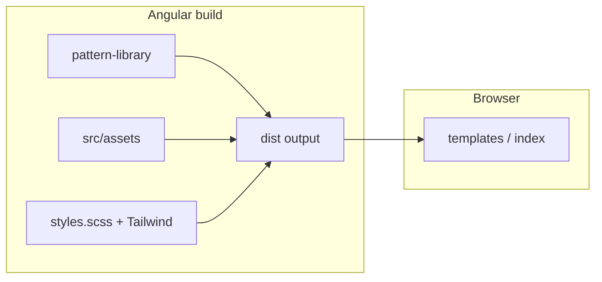

# Pattern library CSS vendored in-repo

## Design

### Scope of work

- Remove `@concentricsky/wgu-design-system-patternlibrary` from `ui/package.json`.
- Commit npm **v13.0.0 `dist/`** under **`ui/src/pattern-library/`** (upstream
  SCSS lost; **dist-only**).
- **Prettier-format** `ui/src/pattern-library/css/screen.css` only (no split into
  partials, no structural reverse engineering).
- Update **`ui/angular.json`** (global `styles` + assets glob) so output stays
  **`/assets/...`** compatible with templates and CSS `url(...)`.
- Add **`docs/features/2026-03-19-pattern-library-css-in-repo.md`**; update
  **`docs/features/2026-03-04-tailwind-css.md`** for in-repo paths.
- Long term: Tailwind migration per existing feature doc; this plan does not
  finish that migration.

### File structure

```
ui/
├── package.json                         # UPDATE: remove pattern lib dep
├── package-lock.json                    # UPDATE: lockfile refresh
├── angular.json                         # UPDATE: styles + assets paths
└── src/
    ├── pattern-library/                 # NEW: vendored npm dist/
    │   ├── README.md                    # NEW: provenance (pkg + version)
    │   ├── css/
    │   │   ├── screen.css               # NEW → formatted (Prettier)
    │   │   ├── fonts/
    │   │   ├── images/
    │   │   └── maps/
    │   ├── icons/
    │   └── images/
    ├── assets/                          # UNCHANGED: app-only files
    └── styles.scss
```

```
docs/
├── features/
│   ├── 2026-03-04-tailwind-css.md       # UPDATE: vendored paths
│   └── 2026-03-19-pattern-library-css-in-repo.md  # NEW (when implemented)
└── plans-done/
    └── 2026-03-19-pattern-library-css-in-repo.md    # this file (archived)
```

### Conceptual architecture

Global styles load in this order (unchanged semantics):

1. **Pattern library** – `pattern-library/css/screen.css` (variables, legacy
   classes, font faces, `url()` to `css/fonts` and `css/images`).
2. **App** – `styles.scss` (Tailwind layers + overrides).

The build copies **`src/pattern-library/**`** into output **`./assets`** (same
glob pattern as today’s `node_modules/.../dist` copy) so **`/assets/images/...`**
and **`/assets/icons/...`** stay stable. **`src/assets`** merges OSMT-only files
(e.g. `svg-extra-defs.svg`) without filename clashes.



### Main components and how they interact

| Piece | Role |
| ----- | ---- |
| `pattern-library/css/screen.css` | Legacy design system; load before Tailwind. |
| `pattern-library/css/fonts`, `css/images` | `url(...)` relative to CSS file. |
| `pattern-library/images`, `icons` | Copied to `/assets/...` for HTML/templates. |
| `src/assets` | App-only assets; merged into same `/assets` output. |
| `angular.json` | Style order + asset glob `input` / `output`. |

## Phases

### Phase 1: Vendor dist snapshot

#### Scope of phase

Copy npm **`dist/`** into **`ui/src/pattern-library/`** (mirror `css/`, `images/`,
`icons/`). Add **`README.md`** (package name, version **13.0.0**, vendored from
npm, prefer Tailwind for new UI).

#### Code organization reminders

- One provenance README at the root of `pattern-library/`.
- Any scratch work: `TODO` + remove before final phase.

#### Implementation details

- Copy from
  `ui/node_modules/@concentricsky/wgu-design-system-patternlibrary/dist/*`
  into `ui/src/pattern-library/` (children of `dist`, not a nested `dist`
  folder).
- Keep **`css/maps/screen.css.map`** if present (optional debugging).

#### Tests

- Static files only; compare file list to npm `dist/`.

#### Validate

- Spot-check paths vs npm `dist/`. Full build after phase 3.

### Phase 2: Prettier `screen.css`

#### Scope of phase

Format **`ui/src/pattern-library/css/screen.css`** with Prettier (project print
width). No manual restructuring.

#### Code organization reminders

- Existing `ui` format globs already include `src/**/*.css` via `css` extension.

#### Implementation details

- `cd ui && npx prettier --write src/pattern-library/css/screen.css`

#### Tests

- None.

#### Validate

- `cd ui && npm run format:check`

### Phase 3: Angular wiring and remove npm dependency

#### Scope of phase

- **`angular.json`**: `styles` → `src/pattern-library/css/screen.css` then
  `src/styles.scss`.
- **`angular.json`**: assets glob `input` → `src/pattern-library`, `output` →
  `./assets`, `glob` → `**/*`.
- Remove **`@concentricsky/wgu-design-system-patternlibrary`** from
  **`package.json`**; **`npm install`** in `ui`.

#### Code organization reminders

- Do not change Karma test `styles` unless something breaks (today: only
  `src/styles.scss`).

#### Implementation details

- `rg wgu-design-system|concentricsky/wgu` under `ui/` after install; should be
  clean aside from docs if any.

#### Tests

- `cd ui && npm run ci-test`

#### Validate

- `cd ui && npm run build`
- `cd ui && npm run ci-test`
- `cd ui && npm run lint`

### Phase 4: Documentation

#### Scope of phase

- New **`docs/features/2026-03-19-pattern-library-css-in-repo.md`**: scope,
  paths, version, link to Tailwind feature doc.
- Update **`docs/features/2026-03-04-tailwind-css.md`**: in-repo paths, no npm
  package name for `screen.css`.

#### Code organization reminders

- Match tone of other `docs/features/*.md` files.

#### Implementation details

- `rg wgu-design-system-patternlibrary docs/`

#### Tests

- N/A.

#### Validate

- Proofread links and paths.

### Phase 5: Cleanup & validation

#### Scope of phase

- Grep diff for `TODO`, debug noise, stale `node_modules` path references.
- **`format:check`**, **lint**, **build**, **ci-test** clean.

#### Plan cleanup

- **Done** – this file lives under **`docs/plans-done/`**.
- Commit with Conventional Commits, e.g.
  `feat(ui): vendor WGU pattern library CSS in-repo`

#### Code organization reminders

- No committed `node_modules` changes beyond lockfile.

#### Implementation details

- Final `rg` for package name in `ui/`.

#### Tests

- `cd ui && npm run ci-test`

#### Validate

- `cd ui && npm run format:check && npm run lint && npm run build`

## Notes

Resolved Q&A (for traceability):

- **Q1**: Original pattern-library source unavailable → vendor **npm `dist/`
  only** (v13.0.0).
- **Q2**: **`ui/src/pattern-library/`** mirroring `dist/`.
- **Q3**: **Prettier only** on `screen.css`; no file split.
- **Q4**: New feature doc + **update** Tailwind feature doc.

**Pre-implementation snapshot (historical)**

- Dep was `@concentricsky/wgu-design-system-patternlibrary@13.0.0` from npm;
  `angular.json` pointed at `node_modules/.../dist`.

## Implementation summary (completed)

- Vendored package **`dist/`** to **`ui/src/pattern-library/`** with
  **`README.md`** and Prettier-formatted **`css/screen.css`**.
- **`ui/angular.json`**: `styles` + assets glob use `src/pattern-library`.
- Removed npm dependency; refreshed **`package-lock.json`**.
- **`docs/features/2026-03-19-pattern-library-css-in-repo.md`** added;
  **`docs/features/2026-03-04-tailwind-css.md`** updated for in-repo paths.
- Validated: `npm run format:check`, `lint`, `build`, `ci-test` in **`ui/`**.
